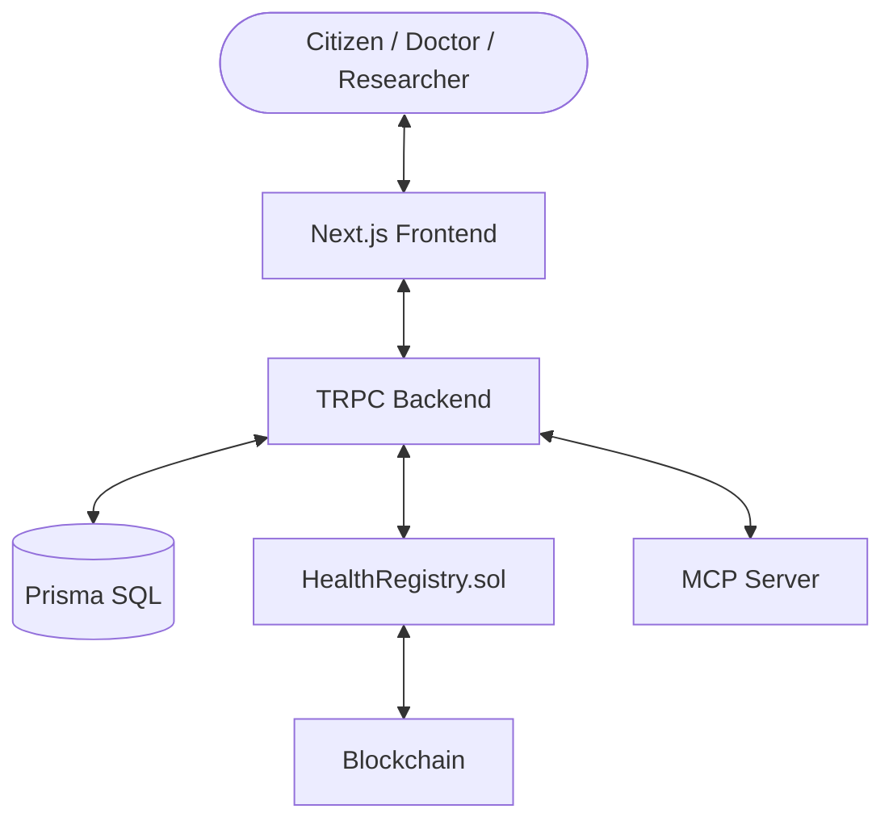

# Architecture Overview

Nirog Bharat follows a decentralized, multi-layered architecture designed for security, privacy, and scalability.

## High-Level Architecture

### 1. Frontend Layer (`apps/web`)
- **Framework:** Next.js 15 (App Router)
- **State Management:** TRPC Hooks + React State
- **Role-Based Access:** Modularized views for Patients, Doctors, Pharma, and Researchers.
- **Design:** Modern CSS with Tailwind, focused on "Realism" and "Professionalism".

### 2. Backend Layer (`apps/api`)
- **API Protocol:** TRPC (Type-safe RPC) for seamless integration with the frontend.
- **ORM:** Prisma with SQLite for rapid development and audit trails.
- **Auth:** NextAuth integrated with cryptographic wallet signatures.

### 3. Blockchain Layer (`packages/contracts`)
- **Smart Contract:** `HealthRegistry.sol`
- **Responsibilities:** 
  - Storing IPFS hashes of medical records.
  - Managing consent lists.
  - Logging "Break-Glass" emergency access.
  - Distribution of NIROG incentive tokens.

### 4. Integration Layer (`apps/mcp-server`)
- **Protocol:** Model Context Protocol (MCP)
- **Purpose:** Allows AI assistants to interact with the Nirog Bharat infrastructure securely, listing tools and performing verified actions on behalf of the user.

## Data Privacy Model

- **Patient Ownership:** All medical records are encrypted and stored off-chain (IPFS). Only the hash is stored on-chain.
- **ZKP Research:** Researchers query the network using Zero-Knowledge Proofs. They get aggregate counts or trends without ever accessing raw patient data.
- **Immutable Audit:** Any time a doctor accesses a record, a signed transaction is recorded on-chain, creating an unerasable audit trail.
